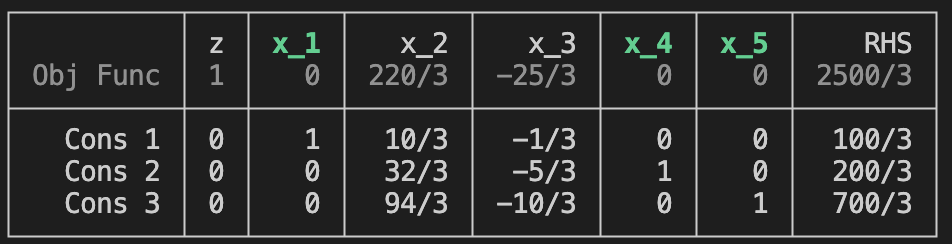

# Bases

## Setting a Basis

Use `set_basis!(T, B)` to specify a starting basis for the tableau. 
Here, `B` is a list (`Vector`) of integers specifying the columns that are in the basis. 

```
julia> T
┌──────────┬───┬─────┬─────┬─────┬─────┬─────┬─────┐
│          │ z │ x_1 │ x_2 │ x_3 │ x_4 │ x_5 │ RHS │
│ Obj Func │ 1 │ -25 │ -10 │   0 │   0 │   0 │   0 │
├──────────┼───┼─────┼─────┼─────┼─────┼─────┼─────┤
│   Cons 1 │ 0 │   3 │  10 │  -1 │   0 │   0 │ 100 │
│   Cons 2 │ 0 │   5 │   6 │   0 │  -1 │   0 │ 100 │
│   Cons 3 │ 0 │  10 │   2 │   0 │   0 │  -1 │ 100 │
└──────────┴───┴─────┴─────┴─────┴─────┴─────┴─────┘

julia> set_basis!(T,[1,4,5])
┌──────────┬───┬─────┬───────┬───────┬─────┬─────┬────────┐
│          │ z │ x_1 │   x_2 │   x_3 │ x_4 │ x_5 │    RHS │
│ Obj Func │ 1 │   0 │ 220/3 │ -25/3 │   0 │   0 │ 2500/3 │
├──────────┼───┼─────┼───────┼───────┼─────┼─────┼────────┤
│   Cons 1 │ 0 │   1 │  10/3 │  -1/3 │   0 │   0 │  100/3 │
│   Cons 2 │ 0 │   0 │  32/3 │  -5/3 │   1 │   0 │  200/3 │
│   Cons 3 │ 0 │   0 │  94/3 │ -10/3 │   0 │   1 │  700/3 │
└──────────┴───┴─────┴───────┴───────┴─────┴─────┴────────┘
```

> Note: On the screen, the headings for the basis (in this case, `x_1`, `x_4`, and `x_5`) appear in green. 


The `set_basis!` function can also be invoked without specifying a basis, i.e. `set_basis(T)`. 
In this case, a basis is generated using `find_a_basis`.

## Finding a Basis


The function `find_a_basis(T)` returns a feasible basis for `T` using the phase-one method.
```
julia> T
┌──────────┬───┬────────┬─────────┬─────┬─────┬─────┬───────┐
│          │ z │    x_1 │     x_2 │ x_3 │ x_4 │ x_5 │   RHS │
│ Obj Func │ 1 │ 61/200 │ 109/200 │   0 │   0 │   0 │     0 │
├──────────┼───┼────────┼─────────┼─────┼─────┼─────┼───────┤
│   Cons 1 │ 0 │  -7/10 │   -9/10 │  -1 │   0 │   0 │ -5000 │
│   Cons 2 │ 0 │  -1/10 │   -1/20 │   0 │  -1 │   0 │  -500 │
│   Cons 3 │ 0 │      1 │    -1/2 │   0 │   0 │  -1 │     0 │
└──────────┴───┴────────┴─────────┴─────┴─────┴─────┴───────┘


julia> find_a_basis(T)
3-element Vector{Int64}:
 1
 2
 4
```


The function `find_all_bases(T)` returns a list of all feasible bases for `T`:
```
julia> find_all_bases(T)
6-element Vector{Vector{Int64}}:
 [1, 2, 4]
 [1, 2, 5]
 [1, 3, 4]
 [1, 3, 5]
 [2, 3, 4]
 [3, 4, 5]
```
Note that `find_all_bases` is rather inefficient as it considers all possible `m`-element subsets of the columns.

