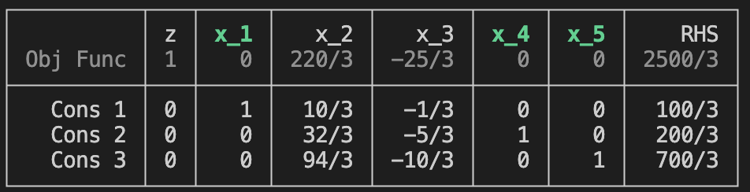

# Creating and Solving Linear Programs

## Create the Tableau

### Canonical LPs

A canonical LP has the form $\min c^T x$ s.t. $Ax ≥ b, x \ge 0$. To set up a tableau for this problem simply create the matrix `A` and the vectors `b` and `c`, and call `Tableau(A,b,c)`. 

For example, let `A`, `b`, and `c` be as follows:
```
julia> A = [3 10; 5 6; 10 2];

julia> b = [100, 100, 100];

julia> c = [25, 10];

julia> Tableau(A, b, c)
┌──────────┬───┬─────┬─────┬─────┬─────┬─────┬─────┐
│          │ z │ x_1 │ x_2 │ x_3 │ x_4 │ x_5 │ RHS │
│ Obj Func │ 1 │ -25 │ -10 │   0 │   0 │   0 │   0 │
├──────────┼───┼─────┼─────┼─────┼─────┼─────┼─────┤
│   Cons 1 │ 0 │   3 │  10 │  -1 │   0 │   0 │ 100 │
│   Cons 2 │ 0 │   5 │   6 │   0 │  -1 │   0 │ 100 │
│   Cons 3 │ 0 │  10 │   2 │   0 │   0 │  -1 │ 100 │
└──────────┴───┴─────┴─────┴─────┴─────┴─────┴─────┘
```
Notice that extra variables $x_3$, $x_4$, and $x_5$ are added to the `Tableau` 
as slack variables to convert inequalities into equations. That is, canonical 
form LPs are automatically converted into standard form. 

### Standard LPs

A linear program in standard form is $\min c^T x$ s.t. $Ax = b$, $x ≥ 0$. 
For example,
```
julia> A = [2 1 0 9 -1; 1 1 -1 5 1]
2×5 Matrix{Int64}:
 2  1   0  9  -1
 1  1  -1  5   1

julia> b = [9, 7]
2-element Vector{Int64}:
 9
 7

julia> c = [2, 4, 2, 1, -1]
5-element Vector{Int64}:
  2
  4
  2
  1
 -1

julia> T = Tableau(A, b, c, false)
┌──────────┬───┬─────┬─────┬─────┬─────┬─────┬─────┐
│          │ z │ x_1 │ x_2 │ x_3 │ x_4 │ x_5 │ RHS │
│ Obj Func │ 1 │  -2 │  -4 │  -2 │  -1 │   1 │   0 │
├──────────┼───┼─────┼─────┼─────┼─────┼─────┼─────┤
│   Cons 1 │ 0 │   2 │   1 │   0 │   9 │  -1 │   9 │
│   Cons 2 │ 0 │   1 │   1 │  -1 │   5 │   1 │   7 │
└──────────┴───┴─────┴─────┴─────┴─────┴─────┴─────┘
```
The fourth argument `false` means that the constraints are already equalities and slack variables should not be appended. 


## Specify a Basis

Use `set_basis!(T, B)` to specify a staring basis for the tableau. Here, `B` is a list (`Vector`)
of integers specifying the columns that are in the basis. 

```
julia> set_basis!(T,[1,4,5])
┌──────────┬───┬─────┬───────┬───────┬─────┬─────┬────────┐
│          │ z │ x_1 │   x_2 │   x_3 │ x_4 │ x_5 │    RHS │
│ Obj Func │ 1 │   0 │ 220/3 │ -25/3 │   0 │   0 │ 2500/3 │
├──────────┼───┼─────┼───────┼───────┼─────┼─────┼────────┤
│   Cons 1 │ 0 │   1 │  10/3 │  -1/3 │   0 │   0 │  100/3 │
│   Cons 2 │ 0 │   0 │  32/3 │  -5/3 │   1 │   0 │  200/3 │
│   Cons 3 │ 0 │   0 │  94/3 │ -10/3 │   0 │   1 │  700/3 │
└──────────┴───┴─────┴───────┴───────┴─────┴─────┴────────┘
```
> Note: On the screen, the headings for the basis (in this case, `x_1`, `x_3`, and `x_4`) appear in green. 



### Tools to find a basis

The function `find_all_bases(T)` returns a list of all feasible bases for `T`:
```
julia> find_all_bases(T)
4-element Vector{Vector{Int64}}:
 [1, 2, 3]
 [1, 2, 5]
 [1, 4, 5]
 [2, 3, 4]
```
The function `find_a_basis(T)` returns a feasible basis for `T` (the first it finds).
```
julia> find_a_basis(T)
3-element Vector{Int64}:
 1
 2
 3
```

These are inefficient functions. We plan to change the implementation of `find_a_basis` to something more performant. 


## Perform the Simplex Algorithm

Once a tableau has been set up with a feasible basis, use `simplex_solve!(T)` to run the simplex algorithm and return solution to the LP.
```
julia> simplex_solve!(T)
Starting tableau

┌──────────┬───┬─────┬───────┬───────┬─────┬─────┬────────┐
│          │ z │ x_1 │   x_2 │   x_3 │ x_4 │ x_5 │    RHS │
│ Obj Func │ 1 │   0 │ 220/3 │ -25/3 │   0 │   0 │ 2500/3 │
├──────────┼───┼─────┼───────┼───────┼─────┼─────┼────────┤
│   Cons 1 │ 0 │   1 │  10/3 │  -1/3 │   0 │   0 │  100/3 │
│   Cons 2 │ 0 │   0 │  32/3 │  -5/3 │   1 │   0 │  200/3 │
│   Cons 3 │ 0 │   0 │  94/3 │ -10/3 │   0 │   1 │  700/3 │
└──────────┴───┴─────┴───────┴───────┴─────┴─────┴────────┘

Column 4 leaves basis and column 2 enters

┌──────────┬───┬─────┬─────┬───────┬────────┬─────┬──────┐
│          │ z │ x_1 │ x_2 │   x_3 │    x_4 │ x_5 │  RHS │
│ Obj Func │ 1 │   0 │   0 │  25/8 │  -55/8 │   0 │  375 │
├──────────┼───┼─────┼─────┼───────┼────────┼─────┼──────┤
│   Cons 1 │ 0 │   1 │   0 │  3/16 │  -5/16 │   0 │ 25/2 │
│   Cons 2 │ 0 │   0 │   1 │ -5/32 │   3/32 │   0 │ 25/4 │
│   Cons 3 │ 0 │   0 │   0 │ 25/16 │ -47/16 │   1 │ 75/2 │
└──────────┴───┴─────┴─────┴───────┴────────┴─────┴──────┘

Column 5 leaves basis and column 3 enters

┌──────────┬───┬─────┬─────┬─────┬────────┬───────┬─────┐
│          │ z │ x_1 │ x_2 │ x_3 │    x_4 │   x_5 │ RHS │
│ Obj Func │ 1 │   0 │   0 │   0 │     -1 │    -2 │ 300 │
├──────────┼───┼─────┼─────┼─────┼────────┼───────┼─────┤
│   Cons 1 │ 0 │   1 │   0 │   0 │   1/25 │ -3/25 │   8 │
│   Cons 2 │ 0 │   0 │   1 │   0 │   -1/5 │  1/10 │  10 │
│   Cons 3 │ 0 │   0 │   0 │   1 │ -47/25 │ 16/25 │  24 │
└──────────┴───┴─────┴─────┴─────┴────────┴───────┴─────┘

Optimality reached
Value = 300
5-element Vector{Rational}:
  8
 10
 24
  0
  0
```

