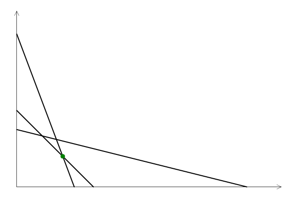

# SimpleTableaux


This is an illusration project for solving 
feasible optimization problems of the form 
$\max c^t x$ subject to $Ax ≤ b$ and $x \ge 0$.

For a quick introduction (and caveats), see the 
[README](https://github.com/scheinerman/SimpleTableaux.jl/blob/main/README.md) on GitHub.

## Creating a `Tableau`

To set up a `Tableau` for the LP $\max c^t x$ subject to $Ax ≤ b$ and $x \ge 0$ use `Tableau(A,b,c)`. 

```julia
A = [8 3; 1 1; 1 4]
b = [24; 4; 12]
c = [2; 1]
T = Tableau(A, b, c)
```
This is the result:
```
4×7 DataFrame
 Row │ x1     x2     s1     s2     s3     val    RHS   
     │ Exact  Exact  Exact  Exact  Exact  Exact  Exact 
─────┼─────────────────────────────────────────────────
   1 │ 8      3      1      0      0      0      24
   2 │ 1      1      0      1      0      0      4
   3 │ 1      4      0      0      1      0      12
   4 │ -2     -1     0      0      0      1      0
```

## Pivoting

The functions `pivot(T,i,j)` and `pivot!(T,i,j)` are used to peform a pivot operation at row `i` and column `j`. 
The first version (`pivot`) does returns the result of the pivot, but does not alter `T`. 
The second version (`pivot!`) also performs the pivot, but modifies `T`.

The function `find_pivot` returns the location of the pivot operation that the simplex method would use to solve the LP.

```
julia> T
4×7 DataFrame
 Row │ x1     x2     s1     s2     s3     val    RHS   
     │ Exact  Exact  Exact  Exact  Exact  Exact  Exact 
─────┼─────────────────────────────────────────────────
   1 │ 8      3      1      0      0      0      24
   2 │ 1      1      0      1      0      0      4
   3 │ 1      4      0      0      1      0      12
   4 │ -2     -1     0      0      0      1      0

julia> find_pivot(T)
(1, 1)

julia> pivot(T,1,1)
4×7 DataFrame
 Row │ x1     x2     s1     s2     s3     val    RHS   
     │ Exact  Exact  Exact  Exact  Exact  Exact  Exact 
─────┼─────────────────────────────────────────────────
   1 │ 1      3/8    1/8    0      0      0      3
   2 │ 0      5/8    -1/8   1      0      0      1
   3 │ 0      29/8   -1/8   0      1      0      9
   4 │ 0      -1/4   1/4    0      0      1      6
```

## Solving the LP 

### Solution by pivoting

The function `pivot_solve` produces the optimal solution to the LP. 
```
julia> pivot_solve(T)
4×7 DataFrame
 Row │ x1     x2     s1     s2     s3     val    RHS   
     │ Exact  Exact  Exact  Exact  Exact  Exact  Exact 
─────┼─────────────────────────────────────────────────
   1 │ 8      3      1      0      0      0      24
   2 │ 1      1      0      1      0      0      4
   3 │ 1      4      0      0      1      0      12
   4 │ -2     -1     0      0      0      1      0


Pivot at (1,1)

4×7 DataFrame
 Row │ x1     x2     s1     s2     s3     val    RHS   
     │ Exact  Exact  Exact  Exact  Exact  Exact  Exact 
─────┼─────────────────────────────────────────────────
   1 │ 1      3/8    1/8    0      0      0      3
   2 │ 0      5/8    -1/8   1      0      0      1
   3 │ 0      29/8   -1/8   0      1      0      9
   4 │ 0      -1/4   1/4    0      0      1      6


Pivot at (2,2)

4×7 DataFrame
 Row │ x1     x2     s1     s2     s3     val    RHS   
     │ Exact  Exact  Exact  Exact  Exact  Exact  Exact 
─────┼─────────────────────────────────────────────────
   1 │ 1      0      1/5    -3/5   0      0      12/5
   2 │ 0      1      -1/5   8/5    0      0      8/5
   3 │ 0      0      3/5    -29/5  1      0      16/5
   4 │ 0      0      1/5    2/5    0      1      32/5

Optimum value after 2 iterations = 32/5
2-element Vector{Rational{BigInt}}:
 12//5
  8//5
```
To supress the illustrative output and just present the solution, use `pivot_solve(T, false)`.

The alternative `pivot_solve!` performs the same operations as `pivot_solve` but modifies `T` as it goes.

## The `restore` function

As mentioned, the `pivot!` and `pivot_solve!` functions modify the `Tableau`. Use `restore` to return a `Tableau` to its original state like this: `T = restore(T)`. 

```
julia> T
4×7 DataFrame
 Row │ x1     x2     s1     s2     s3     val    RHS   
     │ Exact  Exact  Exact  Exact  Exact  Exact  Exact 
─────┼─────────────────────────────────────────────────
   1 │ 8      3      1      0      0      0      24
   2 │ 1      1      0      1      0      0      4
   3 │ 1      4      0      0      1      0      12
   4 │ -2     -1     0      0      0      1      0

julia> pivot!(T,1,1);

julia> T
4×7 DataFrame
 Row │ x1     x2     s1     s2     s3     val    RHS   
     │ Exact  Exact  Exact  Exact  Exact  Exact  Exact 
─────┼─────────────────────────────────────────────────
   1 │ 1      3/8    1/8    0      0      0      3
   2 │ 0      5/8    -1/8   1      0      0      1
   3 │ 0      29/8   -1/8   0      1      0      9
   4 │ 0      -1/4   1/4    0      0      1      6

julia> T = restore(T)
4×7 DataFrame
 Row │ x1     x2     s1     s2     s3     val    RHS   
     │ Exact  Exact  Exact  Exact  Exact  Exact  Exact 
─────┼─────────────────────────────────────────────────
   1 │ 8      3      1      0      0      0      24
   2 │ 1      1      0      1      0      0      4
   3 │ 1      4      0      0      1      0      12
   4 │ -2     -1     0      0      0      1      0
```

### Solution by use of an LP solver

The function `lp_solve` also solves the LP, but uses a standard solver (HiGHS):
```
julia> lp_solve(T)
2-element Vector{Float64}:
 2.4000000000000004
 1.599999999999999
```


## Visualization 

For LPs with exactly two variables, the `visualize` function creates a plot of the 
constraints as lines that bound the feasible region and the solution (as a dot).
```
julia> visualize(T)
```


