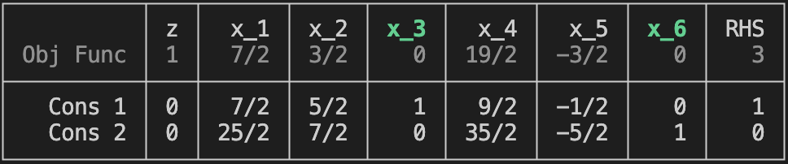

# Tutorial

This is a step-by-step guide for solving linear programs using the `SimplexTableau` module.

## Setting Up

This module enables the user to solve linear program problems in one of the following two forms:
* **Standard**: ``\min c^T  x`` subject to ``A x = b, x ≥ 0``. Use: `Tableau(A,b,c,false)`. 
* **Canonical**: ``\min c^T  x`` subject to ``A x ≥ b, x ≥ 0``. Use: `Tableau(A,b,c)`.

Here, ``A`` is an ``m \times n``-matrix, ``b`` is an ``m``-vector, and ``c`` is an ``n``-vector. 

> Only minimization problems are supported. 

> Every number entered into a `Tableau` must be an  `Integer`  or a `Rational`.  Internally, all numbers are converted to `Rational{BigInt}` type. This module does not support linear programs with floating point data.


### Example: Standard form linear program

Let 
$A=\left[
\begin{array}{rrrrrr}
1 & 8 & -2 & 8 & 6 & -1 \\
2 & 6 & 2 & 9 & 2 & 1 \\
6 & 3 & 5 & 9 & 7 & 1 \\
\end{array}
\right]$, 
$b= \left[
\begin{array}{r}
-2 \\
4 \\
9 \\
\end{array}
\right]$,
and
$c = \left[
\begin{array}{r}
0 \\
3 \\
3 \\
-1 \\
2 \\
-4 \\
\end{array}
\right]$. 

Here is how to set up the standard LP $\min c^T x$ s.t. $Ax=b,x\ge0$:

```
julia> A = [1 8 -2 8 6 -1; 2 6 2 9 2 1; 6 3 5 9 7 1];

julia> b = [-2, 4, 9];

julia> c = [0, 3, 3, -1, 2, -4];

julia> T = Tableau(A, b, c, false)
┌──────────┬───┬─────┬─────┬─────┬─────┬─────┬─────┬─────┐
│          │ z │ x_1 │ x_2 │ x_3 │ x_4 │ x_5 │ x_6 │ RHS │
│ Obj Func │ 1 │   0 │  -3 │  -3 │   1 │  -2 │   4 │   0 │
├──────────┼───┼─────┼─────┼─────┼─────┼─────┼─────┼─────┤
│   Cons 1 │ 0 │   1 │   8 │  -2 │   8 │   6 │  -1 │  -2 │
│   Cons 2 │ 0 │   2 │   6 │   2 │   9 │   2 │   1 │   4 │
│   Cons 3 │ 0 │   6 │   3 │   5 │   9 │   7 │   1 │   9 │
└──────────┴───┴─────┴─────┴─────┴─────┴─────┴─────┴─────┘
```
Note the `false` in the function call; it indicates that this is not canoncial (that is, it is standard) so no slack variables are added. 

Written as a (partitioned) matrix, this tableau looks like this:

$\left[
\begin{array}{r|rrrrrr|r}
1 & 0 & -3 & -3 & 1 & -2 & 4 & 0 \\ \hline
0 & 1 & 8 & -2 & 8 & 6 & -1 & -2 \\
0 & 2 & 6 & 2 & 9 & 2 & 1 & 4 \\
0 & 6 & 3 & 5 & 9 & 7 & 1 & 9 \\
\end{array}
\right]$


The top (header) row represents the objective function we wish to minimize:
$z = 0x_1 + 3x_2 + 3x_3 - x_4 + 2x_5 - 4x_6$. It is rearranged to appear in the form 
$z - 0x_1 - 3x_2 - 3x_3 + x_4 - 2x_5 + 4x_6 = 0$. 

The next three rows are the constraints from $A x = b$. For example, the first constraint is
$x_1 + 8x_2 - 2x_3 + 8x_4 + 6x_5 - x_6 = -2$.


### Example: Canonical form linear program

Let $A=\left[
\begin{array}{rrrr}
7 & 5 & 2 & 9 \\
5 & 9 & 5 & 5 \\
\end{array}
\right]$, 
$b=\left[
\begin{array}{r}
2 \\
5 \\
\end{array}
\right]
$, and
$c=\left[
\begin{array}{r}
7 \\
6 \\
3 \\
4 \\
\end{array}
\right]$. 

Here is how to set up the canonical LP $\min c^T x$ s.t. $Ax\ge b, x\ge0$:

```
julia> A = [7 5 2 9; 5 9 5 5];

julia> b = [2, 5];

julia> c = [7, 6, 3, 4];

julia> T = Tableau(A, b, c)
┌──────────┬───┬─────┬─────┬─────┬─────┬─────┬─────┬─────┐
│          │ z │ x_1 │ x_2 │ x_3 │ x_4 │ x_5 │ x_6 │ RHS │
│ Obj Func │ 1 │  -7 │  -6 │  -3 │  -4 │   0 │   0 │   0 │
├──────────┼───┼─────┼─────┼─────┼─────┼─────┼─────┼─────┤
│   Cons 1 │ 0 │   7 │   5 │   2 │   9 │  -1 │   0 │   2 │
│   Cons 2 │ 0 │   5 │   9 │   5 │   5 │   0 │  -1 │   5 │
└──────────┴───┴─────┴─────┴─────┴─────┴─────┴─────┴─────┘
```
Note that $x_5$ and $x_6$ are added as slack variables. Therefore the first constraint is
$7x_1 + 5x_2 +2 x_3 +9x_4 - x_5=2$ which is equivalent to
$7x_1 + 5x_2 +2 x_3 +9x_4 \ge 2$. With these extra variables, the LP is now in standard form.

The objective function is $z = 7x_1 + 6x_2 + 3x_3 + 4x_4$ that is encoded in the tableau 
as $z-7x_1 -6x_2 -3x_3 -4x_4=0$. 


## Pivoting

Pivoting is a fundamental operation in linear algebra that is used extensively in the Simplex Method. A pivot on element $a_{ij}$ of a matrix begins by multiplying row $i$ by $1/a_{ij}$. This leaves a $1$ in position $i,j$. Then multiples of row $i$ are added to the other rows so that all the other entries in column $j$ are now $0$. 

For example, suppose we wish to pivot on the $2$ in this matrix:

$\left[
\begin{array}{r|rrrrrr|r}
1 & -7 & -6 & -3 & -4 & 0 & 0 & 0 \\ \hline
0 & 7 & 5 & \fbox2 & 9 & -1 & 0 & 2 \\
0 & 5 & 9 & 5 & 5 & 0 & -1 & 5 \\
\end{array}
\right]$

The main body of the matrix lies below the header row and between the vertical dividers. This is considered to be the $1,3$-entry of the matrix: this corresponds to the constraint $1$ in the column of $x_3$. 

First we multiply row $1$ through by $1/2$:

$\left[
\begin{array}{r|rrrrrr|r}
1 & -7 & -6 & -3 & -4 & 0 & 0 & 0 \\ \hline
0 & 7/2 & 5/2 & 1 & 9/2 & -1/2 & 0 & 1 \\
0 & 5 & 9 & 5 & 5 & 0 & -1 & 5 
\end{array}
\right]$

Then we add $3$ times the first row to the header (row $0$) and $-5$ times the first row to the second row:

$\left[
\begin{array}{r|rrrrrr|r}
1 & 7/2 & 3/2 & 0 & 19/2 & -3/2 & 0 & 3 \\ \hline
0 & 7/2 & 5/2 & 1 & 9/2 & -1/2 & 0 & 1 \\
0 & -25/2 & -7/2 & 0 & -35/2 & 5/2 & -1 & 0 \\
\end{array}
\right]$

In the `SimplexTableau` module, this operation is accomplished with the `pivot!` function:
```
julia> T
┌──────────┬───┬─────┬─────┬─────┬─────┬─────┬─────┬─────┐
│          │ z │ x_1 │ x_2 │ x_3 │ x_4 │ x_5 │ x_6 │ RHS │
│ Obj Func │ 1 │  -7 │  -6 │  -3 │  -4 │   0 │   0 │   0 │
├──────────┼───┼─────┼─────┼─────┼─────┼─────┼─────┼─────┤
│   Cons 1 │ 0 │   7 │   5 │   2 │   9 │  -1 │   0 │   2 │
│   Cons 2 │ 0 │   5 │   9 │   5 │   5 │   0 │  -1 │   5 │
└──────────┴───┴─────┴─────┴─────┴─────┴─────┴─────┴─────┘


julia> pivot!(T,1,3)
[ Info: Unable to infer basis
┌──────────┬───┬───────┬──────┬─────┬───────┬──────┬─────┬─────┐
│          │ z │   x_1 │  x_2 │ x_3 │   x_4 │  x_5 │ x_6 │ RHS │
│ Obj Func │ 1 │   7/2 │  3/2 │   0 │  19/2 │ -3/2 │   0 │   3 │
├──────────┼───┼───────┼──────┼─────┼───────┼──────┼─────┼─────┤
│   Cons 1 │ 0 │   7/2 │  5/2 │   1 │   9/2 │ -1/2 │   0 │   1 │
│   Cons 2 │ 0 │ -25/2 │ -7/2 │   0 │ -35/2 │  5/2 │  -1 │   0 │
└──────────┴───┴───────┴──────┴─────┴───────┴──────┴─────┴─────┘
```


## Bases

The Simplex Method begins by finding a set of $m$ columns (where $m$ is the number of 
constraints) that are linearly independent. We pivot on elements of those columns to 
transform them into standard basis vectors. That is, in each of those columns there is a single $1$ 
all other elements of that column are $0$ (including in the header).

In the example we just considered, we see that pivoting on the $-1$ in the $(2,6)$ position 
will result in columns $3$ and $6$ forming a basis, and so those columns are called *basic*. 
```
julia> T
┌──────────┬───┬───────┬──────┬─────┬───────┬──────┬─────┬─────┐
│          │ z │   x_1 │  x_2 │ x_3 │   x_4 │  x_5 │ x_6 │ RHS │
│ Obj Func │ 1 │   7/2 │  3/2 │   0 │  19/2 │ -3/2 │   0 │   3 │
├──────────┼───┼───────┼──────┼─────┼───────┼──────┼─────┼─────┤
│   Cons 1 │ 0 │   7/2 │  5/2 │   1 │   9/2 │ -1/2 │   0 │   1 │
│   Cons 2 │ 0 │ -25/2 │ -7/2 │   0 │ -35/2 │  5/2 │  -1 │   0 │
└──────────┴───┴───────┴──────┴─────┴───────┴──────┴─────┴─────┘

julia> pivot!(T,2,6)
┌──────────┬───┬──────┬─────┬─────┬──────┬──────┬─────┬─────┐
│          │ z │  x_1 │ x_2 │ x_3 │  x_4 │  x_5 │ x_6 │ RHS │
│ Obj Func │ 1 │  7/2 │ 3/2 │   0 │ 19/2 │ -3/2 │   0 │   3 │
├──────────┼───┼──────┼─────┼─────┼──────┼──────┼─────┼─────┤
│   Cons 1 │ 0 │  7/2 │ 5/2 │   1 │  9/2 │ -1/2 │   0 │   1 │
│   Cons 2 │ 0 │ 25/2 │ 7/2 │   0 │ 35/2 │ -5/2 │   1 │   0 │
└──────────┴───┴──────┴─────┴─────┴──────┴──────┴─────┴─────┘

julia> get_basis(T)
2-element Vector{Int64}:
 3
 6
```
The `get_basis` function returns the current basis. If the tableau does not have a basis, a vector of all zeros is returned. 

On the computer display, the labels of the basic columns are green. 




### Setting a basis

The function `set_basis!` is used to select columns to be a basis. This is invoked as 
`set_basis(T, B)` where `B` is a list of $m$ indices specifying the columns to form a basis. 

For example:
```
julia> set_basis!(T,[2,4])
┌──────────┬───┬────────┬─────┬──────┬─────┬───────┬────────┬──────┐
│          │ z │    x_1 │ x_2 │  x_3 │ x_4 │   x_5 │    x_6 │  RHS │
│ Obj Func │ 1 │ -45/14 │   0 │  1/4 │   0 │ -3/28 │ -17/28 │ 13/4 │
├──────────┼───┼────────┼─────┼──────┼─────┼───────┼────────┼──────┤
│   Cons 1 │ 0 │   5/28 │   1 │  5/8 │   0 │  5/56 │  -9/56 │  5/8 │
│   Cons 2 │ 0 │  19/28 │   0 │ -1/8 │   1 │ -9/56 │   5/56 │ -1/8 │
└──────────┴───┴────────┴─────┴──────┴─────┴───────┴────────┴──────┘
```

However, this basis is not suitable for the Simplex Algorithm because the RHS column contains negative numbers. In other words, $\{2,4\}$  is an *infeasible* basis. On the other hand $\{3,6\}$ yields a 
feasible tableau.
```
julia> set_basis!(T,[3,6])
┌──────────┬───┬──────┬─────┬─────┬──────┬──────┬─────┬─────┐
│          │ z │  x_1 │ x_2 │ x_3 │  x_4 │  x_5 │ x_6 │ RHS │
│ Obj Func │ 1 │  7/2 │ 3/2 │   0 │ 19/2 │ -3/2 │   0 │   3 │
├──────────┼───┼──────┼─────┼─────┼──────┼──────┼─────┼─────┤
│   Cons 1 │ 0 │  7/2 │ 5/2 │   1 │  9/2 │ -1/2 │   0 │   1 │
│   Cons 2 │ 0 │ 25/2 │ 7/2 │   0 │ 35/2 │ -5/2 │   1 │   0 │
└──────────┴───┴──────┴─────┴─────┴──────┴──────┴─────┴─────┘
```


### Automatic basis selection

While any $m$ linearly independent columns may be selected to form a basis, finding a set of columns
that yield a feasible tableau can be difficult. In a later section of this tutorial we describe a method for finding a basis, 
but we also provide tools to make this easy.

The function `find_a_basis` automatically finds a feasible basis. Combined with `set_basis!` 
the resut is a tableau that has been pivoted to a feasible configuation. 
```
julia> T
┌──────────┬───┬─────┬─────┬─────┬─────┬─────┬─────┬─────┐
│          │ z │ x_1 │ x_2 │ x_3 │ x_4 │ x_5 │ x_6 │ RHS │
│ Obj Func │ 1 │  -7 │  -6 │  -3 │  -4 │   0 │   0 │   0 │
├──────────┼───┼─────┼─────┼─────┼─────┼─────┼─────┼─────┤
│   Cons 1 │ 0 │   7 │   5 │   2 │   9 │  -1 │   0 │   2 │
│   Cons 2 │ 0 │   5 │   9 │   5 │   5 │   0 │  -1 │   5 │
└──────────┴───┴─────┴─────┴─────┴─────┴─────┴─────┴─────┘


julia> find_a_basis(T)
2-element Vector{Int64}:
 2
 5

julia> set_basis!(T,[2,5])
┌──────────┬───┬───────┬─────┬─────┬───────┬─────┬──────┬──────┐
│          │ z │   x_1 │ x_2 │ x_3 │   x_4 │ x_5 │  x_6 │  RHS │
│ Obj Func │ 1 │ -11/3 │   0 │ 1/3 │  -2/3 │   0 │ -2/3 │ 10/3 │
├──────────┼───┼───────┼─────┼─────┼───────┼─────┼──────┼──────┤
│   Cons 1 │ 0 │   5/9 │   1 │ 5/9 │   5/9 │   0 │ -1/9 │  5/9 │
│   Cons 2 │ 0 │ -38/9 │   0 │ 7/9 │ -56/9 │   1 │ -5/9 │  7/9 │
└──────────┴───┴───────┴─────┴─────┴───────┴─────┴──────┴──────┘
```

Alternatively, using `set_basis!(T)`, without specifying a basis,  
invokes `find_a_basis` to choose the basis for you. 

If the tableau does not have a feasible basis, `find_a_basis` returns a vector of all zeros.
```
julia> T
┌──────────┬───┬─────┬─────┬─────┬─────┬─────┬─────┐
│          │ z │ x_1 │ x_2 │ x_3 │ x_4 │ x_5 │ RHS │
│ Obj Func │ 1 │  -3 │  -1 │  -5 │  -2 │  -5 │   0 │
├──────────┼───┼─────┼─────┼─────┼─────┼─────┼─────┤
│   Cons 1 │ 0 │   3 │   2 │   2 │   2 │   3 │   4 │
│   Cons 2 │ 0 │   4 │   4 │   3 │   5 │   2 │   2 │
│   Cons 3 │ 0 │   1 │   2 │   4 │   2 │   1 │   1 │
└──────────┴───┴─────┴─────┴─────┴─────┴─────┴─────┘


julia> find_a_basis(T)
[ Info: No basis found.
3-element Vector{Int64}:
 0
 0
 0
```
### Listing all feasible bases

The function `find_all_bases` returns a list of all feasible bases for a tableau:
```
julia> T
┌──────────┬───┬─────┬─────┬─────┬─────┬─────┬─────┬─────┐
│          │ z │ x_1 │ x_2 │ x_3 │ x_4 │ x_5 │ x_6 │ RHS │
│ Obj Func │ 1 │   0 │  -3 │  -3 │   1 │  -2 │   4 │   0 │
├──────────┼───┼─────┼─────┼─────┼─────┼─────┼─────┼─────┤
│   Cons 1 │ 0 │   1 │   8 │  -2 │   8 │   6 │  -1 │  -2 │
│   Cons 2 │ 0 │   2 │   6 │   2 │   9 │   2 │   1 │   4 │
│   Cons 3 │ 0 │   6 │   3 │   5 │   9 │   7 │   1 │   9 │
└──────────┴───┴─────┴─────┴─────┴─────┴─────┴─────┴─────┘


julia> find_all_bases(T)
6-element Vector{Vector{Int64}}:
 [1, 2, 3]
 [1, 3, 4]
 [1, 3, 6]
 [2, 3, 5]
 [3, 4, 5]
 [3, 5, 6]
```

> The `find_all_bases` function is highly inefficient and only suitable for small linear programs. 


## Simplex Method

The Simplex Method finds the minimum objective value for a linear program, as well as the 
vector at which that minimum is achieved. 

### Overview

The steps in the Simplex Method are:

1. Select a feasible starting basis. (If there is no such basis, the LP is infeasible.)
2. Find a column headed by a positive number. (If there are none, the LP has reached an optimal state.)
3. Form the ratios between the righthand column and the positive members of the column selected in step 2. 
4. Pivot on whichever entry in the selected column gives the lowest ratio. (If there are no positive numbers in the selected column, the LP is unbounded.)
5. Go to step 2. 

### Manual execution of the Simplex Algorithm

The first step is to find a first basis for a tableau `T` either:
* Use `B = find_a_basis(T); set_basis!(T,B)` or more simply
* `set_basis!(T)`.

```
julia> T
┌──────────┬───┬─────┬─────┬─────┬─────┬─────┬─────┬─────┐
│          │ z │ x_1 │ x_2 │ x_3 │ x_4 │ x_5 │ x_6 │ RHS │
│ Obj Func │ 1 │   0 │  -3 │  -3 │   1 │  -2 │   4 │   0 │
├──────────┼───┼─────┼─────┼─────┼─────┼─────┼─────┼─────┤
│   Cons 1 │ 0 │   1 │   8 │  -2 │   8 │   6 │  -1 │  -2 │
│   Cons 2 │ 0 │   2 │   6 │   2 │   9 │   2 │   1 │   4 │
│   Cons 3 │ 0 │   6 │   3 │   5 │   9 │   7 │   1 │   9 │
└──────────┴───┴─────┴─────┴─────┴─────┴─────┴─────┴─────┘


julia> set_basis!(T)
┌──────────┬───┬─────────┬──────────┬─────┬─────┬─────┬──────────┬────────┐
│          │ z │     x_1 │      x_2 │ x_3 │ x_4 │ x_5 │      x_6 │    RHS │
│ Obj Func │ 1 │ 795/284 │ -931/142 │   0 │   0 │   0 │ 1265/284 │ 334/71 │
├──────────┼───┼─────────┼──────────┼─────┼─────┼─────┼──────────┼────────┤
│   Cons 1 │ 0 │ 187/284 │ -117/142 │   1 │   0 │   0 │   85/284 │ 110/71 │
│   Cons 2 │ 0 │   -1/71 │    62/71 │   0 │   1 │   0 │     6/71 │   6/71 │
│   Cons 3 │ 0 │ 115/284 │  -15/142 │   0 │   0 │   1 │  -51/284 │   5/71 │
└──────────┴───┴─────────┴──────────┴─────┴─────┴─────┴──────────┴────────┘
```
Later, we show how to find a first basis manually. See *Finding a first basis* later in this tutorial. 

---

Next we need to select a column in which to pivot. In this example, there are two columns headed by positive numbers: Column 1 is headed by 795/284 and column 6 is headed by 1265/284.

It is possible to use the function `find_pivot(T)` to select the element on which to pivot.
```
julia> find_pivot(T)
(2, 6)
```
This tells us to pivot at the $(2,6)$-entry of the tableau (where we see the value $6/71$). 


While the `find_pivot` function suggested we pivot in column 6, we see that column 1 is also headed by a positive number, so we have the option to select a pivot there. 
We can use the `ratios` functions to calculate the appropriate pivot for a user-selected column. 
```
julia> T
┌──────────┬───┬─────────┬──────────┬─────┬─────┬─────┬──────────┬────────┐
│          │ z │     x_1 │      x_2 │ x_3 │ x_4 │ x_5 │      x_6 │    RHS │
│ Obj Func │ 1 │ 795/284 │ -931/142 │   0 │   0 │   0 │ 1265/284 │ 334/71 │
├──────────┼───┼─────────┼──────────┼─────┼─────┼─────┼──────────┼────────┤
│   Cons 1 │ 0 │ 187/284 │ -117/142 │   1 │   0 │   0 │   85/284 │ 110/71 │
│   Cons 2 │ 0 │   -1/71 │    62/71 │   0 │   1 │   0 │     6/71 │   6/71 │
│   Cons 3 │ 0 │ 115/284 │  -15/142 │   0 │   0 │   1 │  -51/284 │   5/71 │
└──────────┴───┴─────────┴──────────┴─────┴─────┴─────┴──────────┴────────┘


julia> ratios(T,1)
        Ratios for column 1 headed by 795/284
                Best pivot is in row 3
┌────────────┬──────────┬────────┬───────┬───────────┐
│ Constraint │ Column 1 │    RHS │ Ratio │   Decimal │
├────────────┼──────────┼────────┼───────┼───────────┤
│          1 │  187/284 │ 110/71 │ 40/17 │ 2.3529412 │
│          2 │    -1/71 │   6/71 │   --- │       --- │
│          3 │  115/284 │   5/71 │  4/23 │ 0.1739130 │
└────────────┴──────────┴────────┴───────┴───────────┘
```
This analysis shows that if we decide to pivot in column 1, we should do so at the $(3,1)$-entry. Here is the result:
```
julia> pivot!(T,3,1)
┌──────────┬───┬─────┬─────────┬─────┬─────┬──────────┬─────────┬───────┐
│          │ z │ x_1 │     x_2 │ x_3 │ x_4 │      x_5 │     x_6 │   RHS │
│ Obj Func │ 1 │   0 │ -134/23 │   0 │   0 │  -159/23 │  131/23 │ 97/23 │
├──────────┼───┼─────┼─────────┼─────┼─────┼──────────┼─────────┼───────┤
│   Cons 1 │ 0 │   0 │  -15/23 │   1 │   0 │ -187/115 │  68/115 │ 33/23 │
│   Cons 2 │ 0 │   0 │   20/23 │   0 │   1 │    4/115 │   9/115 │  2/23 │
│   Cons 3 │ 0 │   1 │   -6/23 │   0 │   0 │  284/115 │ -51/115 │  4/23 │
└──────────┴───┴─────┴─────────┴─────┴─────┴──────────┴─────────┴───────┘
```

Now the column 6 is the only one headed by a positive number. We can use `find_pivot(T)` or use `ratios` to find the smallest ratio:
```
julia> ratios(T,6)
         Ratios for column 6 headed by 131/23
                Best pivot is in row 2
┌────────────┬──────────┬───────┬────────┬───────────┐
│ Constraint │ Column 6 │   RHS │  Ratio │   Decimal │
├────────────┼──────────┼───────┼────────┼───────────┤
│          1 │   68/115 │ 33/23 │ 165/68 │ 2.4264706 │
│          2 │    9/115 │  2/23 │   10/9 │ 1.1111111 │
│          3 │  -51/115 │  4/23 │    --- │       --- │
└────────────┴──────────┴───────┴────────┴───────────┘
```
Pivoting at $(2,6)$:
```
julia> pivot!(T,2,6)
┌──────────┬───┬─────┬────────┬─────┬────────┬───────┬─────┬───────┐
│          │ z │ x_1 │    x_2 │ x_3 │    x_4 │   x_5 │ x_6 │   RHS │
│ Obj Func │ 1 │   0 │ -622/9 │   0 │ -655/9 │ -85/9 │   0 │ -19/9 │
├──────────┼───┼─────┼────────┼─────┼────────┼───────┼─────┼───────┤
│   Cons 1 │ 0 │   0 │  -65/9 │   1 │  -68/9 │ -17/9 │   0 │   7/9 │
│   Cons 2 │ 0 │   0 │  100/9 │   0 │  115/9 │   4/9 │   1 │  10/9 │
│   Cons 3 │ 0 │   1 │   14/3 │   0 │   17/3 │   8/3 │   0 │   2/3 │
└──────────┴───┴─────┴────────┴─────┴────────┴───────┴─────┴───────┘
```
There are no positive entries in the top row signalling that the tableau has reached its optimal state. This is verified by the `status` function:
```
julia> status(T)
:optimal
```
Finally, we get the minimum value and the vector that attains that value:
```
julia> value(T)
-19//9

julia> basic_vector(T)
6-element Vector{Rational}:
  2//3
   0
  7//9
   0
   0
 10//9
```


### Fully automatic execution of the Simplex Algorithm

The `simplex_solve!` function does all the steps of the Simplex Method without requiring any interaction with the user. We return the tableau `T` to its original state with `restore!(T)` and then solve the LP using `simplex_solver`:
```
julia> restore!(T)
┌──────────┬───┬─────┬─────┬─────┬─────┬─────┬─────┬─────┐
│          │ z │ x_1 │ x_2 │ x_3 │ x_4 │ x_5 │ x_6 │ RHS │
│ Obj Func │ 1 │   0 │  -3 │  -3 │   1 │  -2 │   4 │   0 │
├──────────┼───┼─────┼─────┼─────┼─────┼─────┼─────┼─────┤
│   Cons 1 │ 0 │   1 │   8 │  -2 │   8 │   6 │  -1 │  -2 │
│   Cons 2 │ 0 │   2 │   6 │   2 │   9 │   2 │   1 │   4 │
│   Cons 3 │ 0 │   6 │   3 │   5 │   9 │   7 │   1 │   9 │
└──────────┴───┴─────┴─────┴─────┴─────┴─────┴─────┴─────┘

julia> simplex_solve!(T)
[ Info: Finding an initial basis.
Starting basis found: [3, 4, 5]
Starting tableau

┌──────────┬───┬─────────┬──────────┬─────┬─────┬─────┬──────────┬────────┐
│          │ z │     x_1 │      x_2 │ x_3 │ x_4 │ x_5 │      x_6 │    RHS │
│ Obj Func │ 1 │ 795/284 │ -931/142 │   0 │   0 │   0 │ 1265/284 │ 334/71 │
├──────────┼───┼─────────┼──────────┼─────┼─────┼─────┼──────────┼────────┤
│   Cons 1 │ 0 │ 187/284 │ -117/142 │   1 │   0 │   0 │   85/284 │ 110/71 │
│   Cons 2 │ 0 │   -1/71 │    62/71 │   0 │   1 │   0 │     6/71 │   6/71 │
│   Cons 3 │ 0 │ 115/284 │  -15/142 │   0 │   0 │   1 │  -51/284 │   5/71 │
└──────────┴───┴─────────┴──────────┴─────┴─────┴─────┴──────────┴────────┘

Pivot 1 at (2, 6)

┌──────────┬───┬───────┬─────────┬─────┬──────────┬─────┬─────┬─────┐
│          │ z │   x_1 │     x_2 │ x_3 │      x_4 │ x_5 │ x_6 │ RHS │
│ Obj Func │ 1 │ 85/24 │ -631/12 │   0 │ -1265/24 │   0 │   0 │ 1/4 │
├──────────┼───┼───────┼─────────┼─────┼──────────┼─────┼─────┼─────┤
│   Cons 1 │ 0 │ 17/24 │  -47/12 │   1 │   -85/24 │   0 │   0 │ 5/4 │
│   Cons 2 │ 0 │  -1/6 │    31/3 │   0 │     71/6 │   0 │   1 │   1 │
│   Cons 3 │ 0 │   3/8 │     7/4 │   0 │     17/8 │   1 │   0 │ 1/4 │
└──────────┴───┴───────┴─────────┴─────┴──────────┴─────┴─────┴─────┘

Pivot 2 at (3, 1)

┌──────────┬───┬─────┬────────┬─────┬────────┬───────┬─────┬───────┐
│          │ z │ x_1 │    x_2 │ x_3 │    x_4 │   x_5 │ x_6 │   RHS │
│ Obj Func │ 1 │   0 │ -622/9 │   0 │ -655/9 │ -85/9 │   0 │ -19/9 │
├──────────┼───┼─────┼────────┼─────┼────────┼───────┼─────┼───────┤
│   Cons 1 │ 0 │   0 │  -65/9 │   1 │  -68/9 │ -17/9 │   0 │   7/9 │
│   Cons 2 │ 0 │   0 │  100/9 │   0 │  115/9 │   4/9 │   1 │  10/9 │
│   Cons 3 │ 0 │   1 │   14/3 │   0 │   17/3 │   8/3 │   0 │   2/3 │
└──────────┴───┴─────┴────────┴─────┴────────┴───────┴─────┴───────┘

Optimality reached. Pivot count = 2
Minimal value = -19/9 = -2.111111111111111
6-element Vector{Rational}:
  2//3
   0
  7//9
   0
   0
 10//9
```


### Numerically

The function `lp_solve` also solves linear programs but uses floating point rather than exact arithmetic.
It uses the [HiGHS](https://ergo-code.github.io/HiGHS/stable/) solver to find the optimal solution: 

```
julia> lp_solve(T)
Minimal objective value = -2.1111111111111183

6-element Vector{Float64}:
 0.6666666666666666
 0.0
 0.7777777777777776
 0.0
 0.0
 1.1111111111111127
```


## Finding a First Basis

Given a (standard form) linear program with $n$ variables and $m$ constraints, we form an 
auxilliary LP as follows: 

1. Create $m$ additional variables, $x_{n+1}, x_{n+2},\ldots,x_{n+m}$.
1. If a constraint has a negative right-hand side, multiply both sides by $-1$. This ensures that all constraints have a nonnegative right-hand side. 
1. Add a ${}+x_{n+i}$ term to the left-hand side of constraint $i$ for $i=1,2,\ldots,m$. 
1. Use $x_{n+1} + x_{n+2} + \cdots + x_{n+m}$ as the objective function to be minimized.

In this new tableau, it is immediate that the new, auxilliary columns form a feasible basis. 

Use the function `phase_one_tableau` build this auxilliary tableau from the original:
```
julia> T
┌──────────┬───┬─────┬─────┬─────┬─────┬─────┬─────┬─────┐
│          │ z │ x_1 │ x_2 │ x_3 │ x_4 │ x_5 │ x_6 │ RHS │
│ Obj Func │ 1 │   0 │  -3 │  -3 │   1 │  -2 │   4 │   0 │
├──────────┼───┼─────┼─────┼─────┼─────┼─────┼─────┼─────┤
│   Cons 1 │ 0 │   1 │   8 │  -2 │   8 │   6 │  -1 │  -2 │  # note the RHS of row 1 is negative
│   Cons 2 │ 0 │   2 │   6 │   2 │   9 │   2 │   1 │   4 │
│   Cons 3 │ 0 │   6 │   3 │   5 │   9 │   7 │   1 │   9 │
└──────────┴───┴─────┴─────┴─────┴─────┴─────┴─────┴─────┘


julia> TT = phase_one_tableau(T)
┌──────────┬───┬─────┬─────┬─────┬─────┬─────┬─────┬─────┬─────┬─────┬─────┐
│          │ z │ x_1 │ x_2 │ x_3 │ x_4 │ x_5 │ x_6 │ x_7 │ x_8 │ x_9 │ RHS │
│ Obj Func │ 1 │   7 │   1 │   9 │  10 │   3 │   3 │   0 │   0 │   0 │  15 │
├──────────┼───┼─────┼─────┼─────┼─────┼─────┼─────┼─────┼─────┼─────┼─────┤
│   Cons 1 │ 0 │  -1 │  -8 │   2 │  -8 │  -6 │   1 │   1 │   0 │   0 │   2 │ 
│   Cons 2 │ 0 │   2 │   6 │   2 │   9 │   2 │   1 │   0 │   1 │   0 │   4 │
│   Cons 3 │ 0 │   6 │   3 │   5 │   9 │   7 │   1 │   0 │   0 │   1 │   9 │
└──────────┴───┴─────┴─────┴─────┴─────┴─────┴─────┴─────┴─────┴─────┴─────┘

julia> get_basis(TT)
3-element Vector{Int64}:
 7
 8
 9
```

We now solve `TT` by the Simplex Method either manually or automatically:
```
julia> simplex_solve!(TT, false);   # the false argument supresses the verbose output

julia> TT
┌──────────┬───┬─────────┬──────────┬─────┬─────┬─────┬─────────┬─────────┬─────────┬────────┬────────┐
│          │ z │     x_1 │      x_2 │ x_3 │ x_4 │ x_5 │     x_6 │     x_7 │     x_8 │    x_9 │    RHS │
│ Obj Func │ 1 │       0 │        0 │   0 │   0 │   0 │       0 │      -1 │      -1 │     -1 │      0 │
├──────────┼───┼─────────┼──────────┼─────┼─────┼─────┼─────────┼─────────┼─────────┼────────┼────────┤
│   Cons 1 │ 0 │ 187/284 │ -117/142 │   1 │   0 │   0 │  85/284 │  45/284 │   1/142 │ 19/142 │ 110/71 │
│   Cons 2 │ 0 │   -1/71 │    62/71 │   0 │   1 │   0 │    6/71 │   -1/71 │   11/71 │  -4/71 │   6/71 │
│   Cons 3 │ 0 │ 115/284 │  -15/142 │   0 │   0 │   1 │ -51/284 │ -27/284 │ -29/142 │ 17/142 │   5/71 │
└──────────┴───┴─────────┴──────────┴─────┴─────┴─────┴─────────┴─────────┴─────────┴────────┴────────┘

julia> value(TT)
0//1

julia> get_basis(TT)
3-element Vector{Int64}:
 3
 4
 5
```
Because the value of the final auxilliary tableau is zero, its basis is the starting basis for `T`.

> If the final value for the auxilliary tableau is not zero, then the original tableau is infeasible. 

